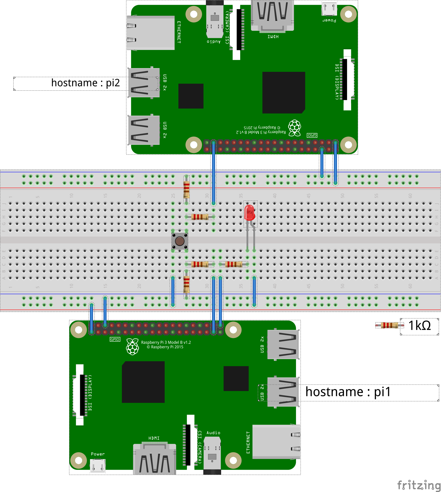

[for Japanese:日本語](README_JP.md)

# Overview

This is not repository for program sources, is lecture series to use ROS2 on Raspberry Pi or similar Single Board Computer installed Ubuntu.

## Final goal
Final goal of learning in this repository is to learn a way to treat hardware by ROS2.
Target circuit is shown in figure below.
Rasp. Pi controls a led and senses a state of a switch.
The examination is to control a led by a state of a switch on ROS2 system. 

# Table of Contents
## For administrator

1. [Installation of Ubuntu Server on Raspberry Pi](docs/Installation_of_UbuntuServer_on_RaspberryPi.md)
1. [Installation of ROS2 on Raspberry Pi](docs/Installation_of_ROS2_on_RaspberryPi.md)
1. [Installation of pigpio library](docs/Installation_of_pigpio_library.md)
1. [Addition of general users](docs/Addition_of_general_users.md)

## For general user
### Preparation

1. [Initial settings](docs/Initial_settings_of_general_users.md)
1. [Usage of pigpiod in C++](docs/Usage_of_pigpiod_in_cpp.md)

### ROS2 programming
Before starting, read [tutorial in official page for foxy](https://docs.ros.org/en/foxy/Tutorials.html).

1. [Creation of a topic message for a state of a switch](docs/Creation_of_a_topic_message_for_a_state_of_a_switch.md)
1. [Publishing topic by pushing/releasing a switch](docs/Publishing_topic_by_pushing_releasing_a_switch.md)
1. [Subscribing topic related to a switch](docs/Subscribing_topic_related_to_a_switch.md)
1. [Publishing and Subscribing on plural Raspberry Pi](docs/Publishing_and_Subscribing_on_plural_Raspberry_Pi.md)
  * For people having two Raspberry Pis.
