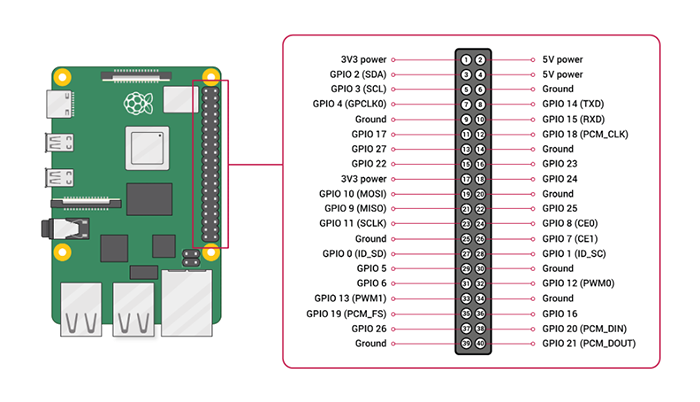

[Topページへ](README_JP.md)

# 概要
pigpio ライブラリに関する情報をまとめたページ．
メインの言語はC/C++とする．

# pigpio ライブラリのインストール

[公式ページ](http://abyz.me.uk/rpi/pigpio/index.html)の[Download & Install page](http://abyz.me.uk/rpi/pigpio/download.html)を見ながらインストール.

# pigpioを用いたプログラミング
ここではGPIO pinのコントロールをするために，pigpioライブラリを直接使用するのではなくpigpioデーモンを通して使用する．
その理由としては，複数人でRaspberry Piを共有したり，作成したプログラムを実行するのにrootにならなければいけないことを避けたいからである．

## pigpioデーモンの準備
以下のファイルを準備する．

* /etc/systemd/system/[pigpiod.service](../system_setting/pigpiod.service)

pigpioデーモンが使用できるオプションは[ここ](http://abyz.me.uk/rpi/pigpio/pigpiod.html)を参照のこと．<br>
pigpioデーモンを有効に有効にするために以下を実行する．

```shell
$ sudo systemctl enable pigpiod
$ sudo systemctl start pigpiod
$ sudo systemctl status pigpiod
```

## 基本的な使い方

[pigpiod C I/F](http://abyz.me.uk/rpi/pigpio/pdif2.html)のページを見ながら作成すれば大体大丈夫．基本的な情報としては以下の通り．

* ヘッダ情報
  * #include <pigpiod_if2.h>
* ビルド/コンパイル情報
  * オプション
    * `-Wall -pthread`
  * リンカ
    * `-lpigpiod_if2`
    * `-lrt`
      * [pigpiod C I/F](http://abyz.me.uk/rpi/pigpio/pdif2.html)ページでは使用されているが不必要．libgccに含まれたとかなんとか．

## ROS2での使用
ROS2でpigpioを使用する場合，CMakeLists.txtは以下のように書く(関係する部分を抜粋)．

```CMakeLists
target_compile_options(<ターゲット名>
  PUBLIC -Wall -pthread
)
target_link_libraries(<ターゲット名>
  pigpiod_if2
)
```

# GPIOピンについて
Raspberry Piの場合，チップによるピンの数え方と基板上からみたピンの数え方が違う．pigpioではチップによるピンの数え方をしているので注意．例えば，下図の右下のピンを使いたい場合は40ではなく21の数字を指定することになる．



またチップ上のピンに対する設定などは以下のp.102あたりが役に立つ．

- [BCM2835](https://www.raspberrypi.org/app/uploads/2012/02/BCM2835-ARM-Peripherals.pdf)

# Tips
## Pull upとPull down
結構大事なのでぐぐるなどして理解しておくとよい．

* [【電子工作】プルアップ回路とプルダウン回路とは？（危険回路についても）](https://qiita.com/nishiwakki/items/e921d44a00a37c72979c)
* [ツール・ラボ 第22回Raspberry PiのGPIO概要](https://tool-lab.com/raspberrypi-startup-22/)

## PC使ったRaspberry Pi開発手順
- [PC使ったRaspberry Pi開発手順](https://qiita.com/NeK/items/d3b6114c85d51823fb6e)
- [Raspberry PiでのプログラミングはAtomエディタが便利](https://mimimopu.com/atom_raspberry_pi_programing/)
    - Atomを使用する場合，こっちの方が圧倒的に楽ちん

## References

- [pigpio公式](http://abyz.me.uk/rpi/pigpio/index.html)
- [githubのpigpio.h](https://github.com/joan2937/pigpio/blob/master/pigpio.h)
    - 細かいところを調べるのに重宝．
- [からあげ Raspberry PiのGPIO制御の決定版 pigpio を試す](https://karaage.hatenadiary.jp/entry/2017/02/10/073000)
    - ここでpigpioを知った．
- 腰も砕けよ 膝も折れよ
    - すごくわかりやすく書いてある．素敵．
        - [その1](https://decafish.blog.so-net.ne.jp/2016-10-15),[その2](https://decafish.blog.so-net.ne.jp/2016-10-16),[その3](https://decafish.blog.so-net.ne.jp/2016-10-20),[その4](https://decafish.blog.so-net.ne.jp/2016-10-22),[その5](https://decafish.blog.so-net.ne.jp/2016-10-29),[その6](https://decafish.blog.so-net.ne.jp/2016-11-13),[その7](https://decafish.blog.so-net.ne.jp/2016-12-11),[その8](https://decafish.blog.so-net.ne.jp/2017-01-09),[その9](https://decafish.blog.so-net.ne.jp/2017-01-29),[その10](https://decafish.blog.so-net.ne.jp/2017-02-05),閑話もあった気がする．
- [Raspberry Pi3でpigpioライブラリを使ってLチカする](https://qiita.com/yuuri23/items/597fd1a40c63627e59c2)
