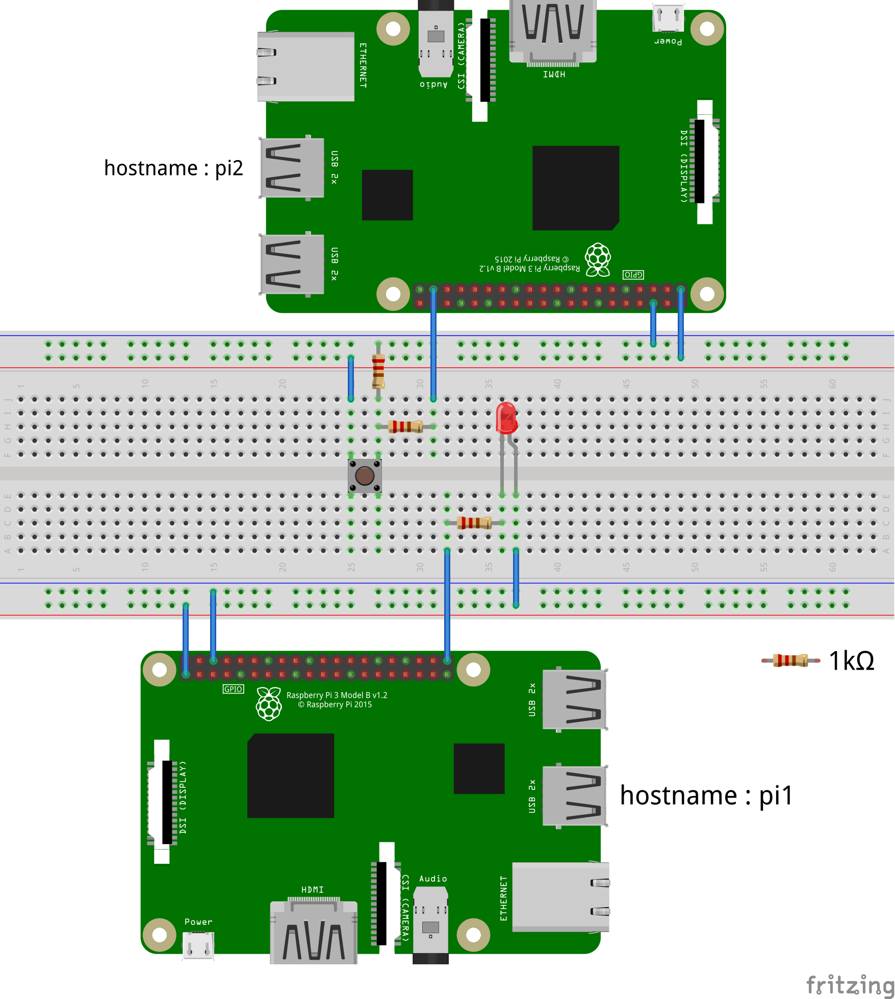

[Topページへ](../README_JP.md)

# 概要
ここでは異なるRaspberry Pi上で複数のノードを実行する方法を述べる．
対象とする状況を下図で表し，ledはpi1につながっており，スイッチはpi2に繋がっているものとする．
もしpi1とpi2がネットワーク経由でつながっているなら，各raspberry piでノードを実行し，スイッチでledをコントロールするのは簡単である．
実際に，異なるraspberry pi上で動かしていることを意識もしないであろう．
普通に，pi1上でsubscriberを，pi2上でpublisherを実行するだけである．
ここではコンポーネントマネージャを使用した方法を紹介する．
各raspberry piにてコンポーネントマネージャを起動するので区別する必要があり，namespaceを利用している．
オプションでnamespaceを利用する場合の詳細情報は[ここ](https://docs.ros.org/en/foxy/Guides/Node-arguments.html)を参照のこと．



# 複数Pi上でコンポーネントマネージャを用いたノードの使用方法
pi1とpi2にてターミナルを起動する．
pi1上では，以下のコマンドにより，`/pi1`のnamespaceを加えてコンポーネントマネージャを起動する．

```shell
$ ros2 run rclcpp_components component_container --ros-args -r __ns:=/pi1
```

次にpi2でターミナルを開き以下を実行する．

```shell
$ ros2 run rclcpp_components component_container --ros-args -r __ns:=/pi2
```

そしてpi1にて新しいターミナルを開き以下を実行する．

```shell
$ . install/local_setup.bash
$ ros2 component load /pi2/ComponentManager gpio_state_recognition_node ros2rasp_lecture::PubGpioStateComponentNode
$ ros2 component load /pi1/ComponentManager gpio_led_control_node ros2rasp_lecture::GpioLedControlComponentNode
```

スイッチを押したり離したりするとledが点灯/消灯することを確認する．
