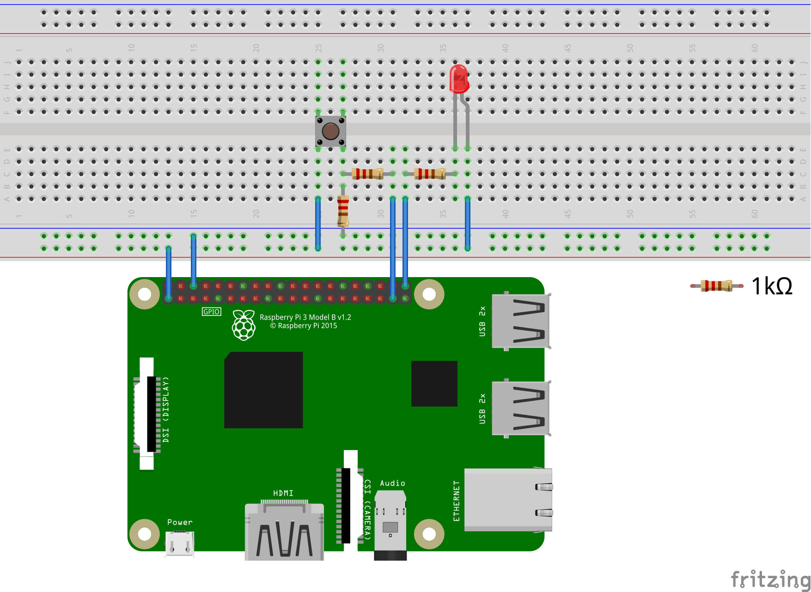

# 概要

このリポジトリはプログラムのためのものではなく，UbuntuがインストールされたRaspberry Piや同様のシングルボードコンピュータ上でROS2を使用するためのレクチャーシリーズです．

## 最終目標
ROS2を使用してハードウェアを使用する方法を学ぶ．
対象とする回路を下図に示しておく．
図ではRaspberry Pi `pi1`によってledを点灯/消灯させ，Raspberry Pi `pi2`でスイッチの状態を認識している．
また`pi1`と`pi2`はネットワークでつながっており，ROS2を使用してスイッチによってledをコントロールさせることを考える． 
もしRaspberry Piが一つしかなくても大丈夫．
`pi2`を`pi1`に読み替えて，一つのRaspberry Piに対するものとして読んでください．

# 目次
## 管理者向け

1. [Raspberry PiへのUbuntu Serverのインストール](Installation_of_UbuntuServer_on_RaspberryPi_JP.md)
1. [Raspberry PiへのROS2のインストール](Installation_of_ROS2_on_RaspberryPi_JP.md)
1. [pigpioのインストール](Installation_of_pigpio_library_JP.md)
1. [一般ユーザの追加](Addition_of_general_users_JP.md)

## 一般ユーザ向け

1. [初期設定](Initial_settings_of_general_users_JP.md)
